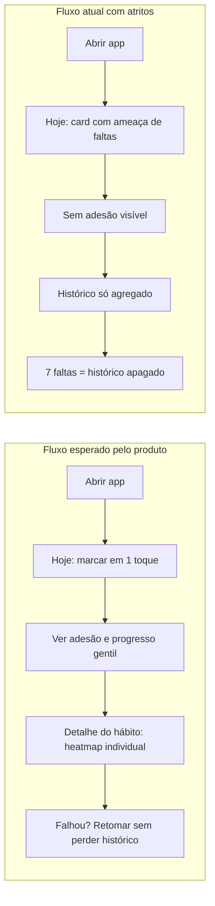

# Avaliação UI/UX (auto) — WRS Habit Builder

> Análise sob a ótica de design de produto e experiência do usuário: conflitos com a tese do app, atritos de usabilidade, lacunas de acessibilidade e propostas de melhoria/inovação. **Gerado em:** junho/2026.

---

## Resumo executivo

O app tem **identidade visual forte**: dark theme coerente, tipografia display (Fraunces) + body (Plus Jakarta Sans), accent configurável, animações refinadas (sweep de conclusão, FLIP na lista, tiers de streak) com respeito a `prefers-reduced-motion`. O nível de polish visual está acima de MVPs típicos.

Os problemas concentram-se na **psicologia do produto** (mecânica punitiva vs. tom "sem culpa"), no **custo de criação** (formulário longo), em **navegação inconsistente** e na **ausência de feedback** em ações importantes. A estética vende consistência gentil; a mecânica, em partes, pune falha de forma severa.

---

## 🔴 Conflitos graves com a tese do produto

### 1. "7 faltas seguidas interrompem a sequência" + apagão de histórico

No card (`habit-card.component.ts`), quando há faltas acumuladas:

```1179:1182:src/app/features/today/components/habit-card/habit-card.component.ts
    const remaining = STREAK_MISS_TOLERANCE - this.missCount();
    const label = remaining === 1 ? 'falta' : 'faltas';

    return `mais ${remaining} ${label} seguidas interrompem a sequência`;
```

A experiência completa:

- **Contagem regressiva de ameaça** no card — ansiogênica, oposta ao tom "Recomeçar amanhã no mesmo gatilho".
- Ao atingir 7 faltas, o backend **apaga todas as completions** — contador "dia N" zera, heatmap esvazia.
- Usuário que retorna de viagem/férias perde evidência de meses de esforço — momento clássico de churn em apps de hábito (efeito "what-the-hell").

**Solução:**

| Antes | Depois |
|-------|--------|
| "mais 3 faltas seguidas interrompem a sequência" | "Sentimos sua falta. Recomece hoje no mesmo gatilho." |
| Histórico apagado ao reset | Sequência atual: 0 · Recorde: 47 · Total: 132 dias |
| Punição máxima | Streak pausada; heatmap e adesão intactos |

**Inovação:** "proteção de sequência" — 1 falta perdoada por semana (conceito de freeze do Duolingo), alinhada à gamificação positiva.

### 2. Taxa de adesão (métrica principal) invisível na UI

RF-08 define adesão 7d/30d como métrica central (*consistência > perfeição*). O app mostra:

- "dia N" (contagem bruta de completions — confunde com streak).
- Heatmap mensal agregado em `/historico`.

Não há nenhum lugar com *"você cumpriu 85% dos dias planejados este mês"*.

**Solução:** chip `85% · 30d` no card; bloco de resumo na tela Histórico; destaque no detalhe do hábito (quando existir).

### 3. Rotas de detalhe e edição não implementadas

Especificação do produto prevê:

| Rota | Status |
|------|--------|
| `/habits/new` | ❌ Modal global |
| `/habits/:id` | ❌ Não existe |
| `/habits/:id/edit` | ❌ Modal global |

Consequências UX:

- Heatmap em `/historico` é **agregado** — impossível responder "como estou na leitura?".
- Cards em "Meus hábitos" só permitem editar/arquivar, sem drill-down.
- Sem URL compartilhável, sem deep link, sem histórico do navegador para criar/editar.

---

## 🟠 Atritos de usabilidade

### 4. Formulário de criação: barreira alta no primeiro uso

Campos obrigatórios para criar hábito: nome, categoria, gatilho(s), recompensa(s), ação mínima, dias da semana, horário (`optionalReminder` com `Validators.required`), metas gerais/dinâmicas opcionais mas com UI complexa.

Conflita com:

- Princípio Fogg (reduzir barreira de entrada).
- Empty state que convida "Construa hábitos agora" → modal de 6+ campos com preview ao vivo.

**Soluções:**

- **Criação em camadas:** obrigatórios = nome + dias. Resto em seção "Refinar (opcional)" colapsada.
- Horário de fato opcional.
- **Templates de partida:** "Leitura — Se café, então 1 página"; um toque preenche; usuário ajusta.

### 5. Modal único vs. página dedicada

Criar/editar vive em `habit-form-modal` montado no `app-root`:

- Back do navegador **não fecha o modal** — fecha a rota.
- Scroll interno longo em mobile (form de 1.330 linhas de componente).
- Clique no backdrop → `close()` → `resetForm()` **sem confirmação** de formulário sujo:

```1217:1226:src/app/shared/components/habit-form-modal/habit-form-modal.component.ts
  protected onBackdropClick(event: MouseEvent): void {
    if (event.target === event.currentTarget) {
      this.close();
    }
  }

  protected close(): void {
    this.modal.close();
    this.resetForm();
  }
```

**Soluções mínimas:** dialog "Descartar alterações?"; suporte a `Esc`; interceptar `popstate` em mobile. **Ideal:** rota full-screen em mobile, modal só em desktop.

### 6. Marquee de gatilhos: informação essencial em movimento

Gatilhos ("Se X, então Y") — núcleo comportamental — rolam em letreiro infinito. Ciclo de velocidade (normal → rápido → pausado) só descoberto ao tocar; compete com "tocar no card = marcar".

- Viola espírito WCAG 2.2.2 (pausa visível para movimento >5s).
- Difícil de ler para déficit de atenção ou baixa visão.

**Solução:** texto estático com truncamento + "expandir"; marquee só para overflow real, com botão de pausa visível.

### 7. Navegação com hierarquia confusa

**Desktop:**

- "Hoje" = botão primário sólido centralizado (parece CTA).
- "Hábitos" / "Histórico" = outline à esquerda.
- "+ Novo hábito" = ícone à direita.
- Três estilos para o mesmo nível hierárquico.

**Mobile (bottom nav):**

- Hoje · Hábitos · FAB+ · **Ajustes**
- **Histórico escondido dentro de Ajustes** — configurações ≠ navegação principal; usuário não procura telas em settings.
- `/data` (Gerenciar dados) também dentro de Ajustes; nenhuma aba marca rota ativa.

**Solução:** nav unificada — Hoje · Hábitos · Histórico (+ FAB criar). Ajustes só para tema, accent e backup.

### 8. Import JSON com espera artificial (5–15 s)

`data-management-page` simula 5 etapas com delay aleatório 1–3 s cada. Import real é síncrono no passo 2. Em área sensível (backup/restauração), espera fabricada **mina confiança**.

**Solução:** import imediato + toast ("6 hábitos e 128 conclusões importados"). Transição de 300–500 ms se quiser peso visual.

### 9. Feedbacks ausentes

| Ação | Comportamento atual | Esperado |
|------|---------------------|----------|
| Arquivar hábito | Card some; sem confirmação, sem undo | Toast "Arquivado · Desfazer" |
| Excluir permanentemente | Modal de confirmação ✓; sem feedback pós-ação | Toast "Hábito excluído" |
| Criar/editar hábito | Modal fecha em silêncio | Toast + highlight do card novo |
| Marcar conclusão | Animação visual ✓ | `aria-live` para leitores de tela |

Não existe componente toast/snackbar no projeto.

---

## 🟡 Refinamentos visuais e acessibilidade

### 10. Empty state "Hoje" esconde contexto

Sem hábitos, o header "Hoje · quinta, 11 de junho" e a barra de progresso somem. A âncora temporal da tela deveria permanecer; só o conteúdo abaixo muda.

### 11. Copy longa e registro informal

Empty state de "dia de descanso" usa frase única longa com "pra" em vez de "para". Título curto + subtítulo + CTA separados melhoram escaneabilidade.

### 12. Streak tiers: delight que vira ruído

Tier 4 com borda cônica animada + pulse de 0,45s em múltiplos cards = tela inteira pulsando. Sugestão: animação "play once" ao atingir tier, depois selo estático.

### 13. Lacunas de acessibilidade

**Bem feito:** `aria-label` em marcar/desmarcar, `aria-modal`, `role="menu"`, focus rings, `day-progress` com `role="progressbar"`.

**Lacunas:**

- Modais sem **focus trap** e sem **Esc** (form, delete confirm, day history).
- Conclusão comunicada só por cor/animação — falta `aria-live`.
- Textos `text-[10px]` (dica de faltas) abaixo do confortável.
- Marquee sem controle de pausa visível.

### 14. Inconsistências menores

- Desmarcar: link discreto no rodapé (desktop) vs. ao lado de "✓ Feito" (mobile).
- Categoria = texto livre; cor do card depende de palavras-chave mágicas ("corpo", "mind") — usuário não sabe que "Academia" não ganha cor.
- Menu de settings: itens em ordem diferente desktop vs. mobile.
- Modo demo (duplo-clique no logo) não documentado — surpresa para quem descobre por acidente.

---

## 💡 Inovações alinhadas à tese

| # | Ideia | Benefício |
|---|-------|-----------|
| 1 | **Swipe para marcar** (mobile) | Ação nº 1 com gesto mais barato; botão como fallback a11y |
| 2 | **Resumo semanal gentil** (segunda-feira) | "86% de adesão, melhor dia: quarta" — consistência sem culpa |
| 3 | **Templates + onboarding 30s** | 3 hábitos-âncora na primeira visita |
| 4 | **Proteção de sequência** (freeze semanal) | Gamificação positiva |
| 5 | **Notificações locais** (PWA) | Horário hoje é decorativo; lembrete real aumenta adesão |
| 6 | **Modo foco "agora"** | Hero card do próximo hábito por horário — uma decisão por vez |
| 7 | **Adesão como narrativa principal** | Substituir "dia N" por "% do plano cumprido" no card |

---

## Mapa de jornada vs. estado atual



---

## Priorização sugerida

| # | Item | Esforço | Impacto UX |
|---|------|---------|------------|
| 1 | Eliminar reset + copy de retomada | M | 🔥 Altíssimo |
| 2 | Toast com undo (arquivar) | S | Alto |
| 3 | Formulário em camadas + horário opcional | M | Alto |
| 4 | Histórico na bottom nav mobile | S | Alto |
| 5 | Adesão 7d/30d visível | M | Alto |
| 6 | Detalhe do hábito (`/habits/:id`) | M/L | Alto |
| 7 | Gatilhos estáticos no card | S | Médio |
| 8 | Focus trap + Esc nos modais | S | Médio |
| 9 | Remover progresso fake do import | S | Médio |
| 10 | Templates/onboarding | M | Médio |

---

## Conclusão

O app **parece** um companheiro gentil de hábitos — visual polido, animações cuidadosas, tom encorajador na copy estática. Em momentos críticos (faltas acumuladas, retorno após pausa, criação do primeiro hábito), a experiência **age** como app punitivo tradicional. Alinhar mecânica à tese (adesão > streak frágil, histórico sagrado, feedback claro) é a alavanca de maior ROI antes de investir em features novas.
