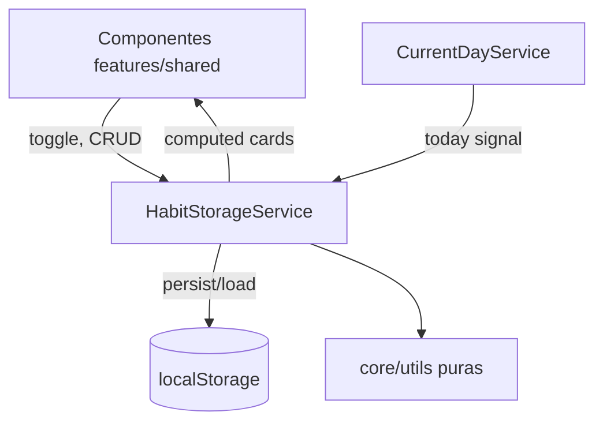

# Arquitetura e Roadmap (auto) — WRS Habit Builder

> Visão de arquiteto de software: estado atual, decisões estruturais, próximos passos técnicos e features que o produto comporta. **Gerado em:** junho/2026.

---

## 1. Fotografia da arquitetura

```
Stack: Angular 21 · Tailwind 4 · SSR/Express · Firebase Hosting · Vitest
Persistência: localStorage (chave "wrs-habit-builder", version: 6)
Estado: signals no HabitStorageService → computed (todayHabitCards, habitListCards)
Deploy: firebase.json + dist/wrs-habit-builder
```

### Estrutura de pastas

```
src/app/
├── core/
│   ├── models/       # Habit, Completion, DTOs, AppStorage
│   ├── services/     # HabitStorage, CurrentDay, Theme, Demo, Modal
│   ├── utils/        # datas, streak, heatmap, sort, normalizer (puros)
│   └── data/         # completion-restore.patch (⚠️ remover)
├── features/
│   ├── today/        # dashboard + habit-card + day-progress
│   ├── habits/       # lista + habit-list-card
│   ├── historico/    # heatmap mensal agregado
│   └── data/         # import/export JSON
└── shared/
    ├── app-nav/      # navegação desktop + mobile
    ├── habit-form-modal/
    └── componentes auxiliares (preview, weekday-schedule, modais)
```

### Fluxo de dados



### Pontos fortes

| Área | Avaliação |
|------|-----------|
| Separação de camadas | Componentes não tocam storage diretamente |
| Lógica de negócio | Funções puras em `core/utils` — baratas de testar e portar |
| Estado reativo | Mutação → signal → computed → UI (unidirecional) |
| Dia atual | `CurrentDayService` centraliza "hoje" — essencial no domínio |
| Offline-first | Por natureza (localStorage); sem dependência de rede |

### Dívidas estruturais

| Área | Problema |
|------|----------|
| Integridade de dados | `reconcileStreakResets` deleta completions |
| Bundle | Patch pessoal hardcoded no `load()` |
| Modelo | `trigger1/2/3` achatado multiplica código |
| Schema | `version: 6` ignorado em `migrate()` |
| Qualidade | Sem CI, sem ESLint, testes parcialmente quebrados |
| Rotas | Faltam `/habits/new`, `/habits/:id`, `/habits/:id/edit` |
| Componentes | 3 arquivos com 500–1.330 linhas |

---

## 2. Gap entre especificação e implementação

| Requisito (produto) | Implementado | Gap |
|---------------------|--------------|-----|
| RF-01 CRUD hábito | ✅ Modal + storage | Rotas dedicadas ausentes |
| RF-03 Listar hábitos do dia | ✅ `/` | — |
| RF-04 Marcar em 1 ação | ✅ toggle | — |
| RF-05 Desmarcar | ✅ | — |
| RF-06 Editar/arquivar | ✅ | Sem undo |
| RF-07 Detalhe + heatmap individual | ❌ | Só heatmap agregado |
| RF-08 Adesão 7d/30d | ❌ | Lógica não exposta na UI |
| RF-09 Streak sem apagar histórico | ❌ | Reset destrutivo ativo |
| Modo demo | ⚠️ Existe | Contradiz spec de produto |

---

## 3. Decisões arquiteturais recomendadas

### D1. Completions como event log imutável (prioridade máxima)

Tratar `HabitCompletion[]` como **fatos históricos append-only**:

```
Regra: nenhuma feature deleta completions
       (exceto exclusão permanente do hábito pelo usuário)

Streak, adesão, recorde, heatmap = projeções derivadas (computed)
```

**Benefícios:**

- Elimina classe inteira de bugs de perda de dados.
- Qualquer métrica futura (recordes, tendências, badges) é computável retroativamente.
- Sync multi-dispositivo futuro: union de logs por `id` é trivial.

### D2. SSR dinâmico → prerender estático (SSG)

O app é 100% client-side. SSR com Express:

- Renderiza casca vazia (servidor não conhece hábitos).
- Adiciona `server.ts`, hydration, guards `isPlatformBrowser` em todo serviço.

**Recomendação:** `outputMode: "static"` com prerender das 4 rotas. Firebase Hosting serve arquivos puros. Mesmo SEO/first-paint, menos código, deploy mais simples.

### D3. Separar persistência, domínio e view-model

Hoje `HabitStorageService` acumula três papéis. Antes de crescer:

```
HabitRepository (porta)
  ← LocalStorageHabitRepository (hoje)
  ← IndexedDbHabitRepository (futuro)

HabitStore (signals + regras de domínio, sem I/O direto)
HabitMetricsService (adesão, streak, recorde — derivado do log)
Mappers (today-habit.mapper, habit-list-card — view-models por tela)
```

### D4. Pipeline de migração versionado

```typescript
function migrate(raw: unknown): AppStorage {
  let data = parseRaw(raw);
  if (data.version < 2) data = migrateV1toV2(data);
  if (data.version < 3) data = migrateV2toV3(data);
  // ...
  return data;
}
```

Cada passo: função pura + teste com fixture JSON real. Remover botão "Atualizar JSON" de `/data`.

### D5. Rotas alinhadas ao produto

```
/                    → Hoje
/habits              → Lista
/habits/new          → Criar (página em mobile, modal em desktop opcional)
/habits/:id          → Detalhe (heatmap individual, adesão, streak)
/habits/:id/edit     → Editar
/historico           → Visão agregada (manter ou renomear para /history)
/data                → Backup (settings, não nav principal)
```

---

## 4. Roadmap técnico

### Fase 0 — Estancar riscos (1–2 dias)

| Item | Critério de pronto |
|------|-------------------|
| Remover `reconcileStreakResets` e effect destrutivo | Completions nunca deletadas por streak |
| Remover `COMPLETION_RESTORE_PATCH` | Bundle sem dados pessoais |
| Consertar `habit-sort.utils.spec.ts` + `app.spec.ts` | `npm test` verde |
| `.gitignore` → `.firebase/` | Repo limpo |

### Fase 1 — Fundação (1 semana)

- **CI (GitHub Actions):** lint + test + build em PR.
- **ESLint + angular-eslint** (hoje só Prettier).
- **Testes `HabitStorageService`:** toggle, archive, import/export roundtrip, migração.
- **Refatorar monolitos:** form-modal, habit-card, app-nav → subcomponentes + arquivos externos.
- **Modelo v7:** `triggers[]`, `motivations[]`, naming em inglês (`generalGoal`, `dynamicGoals`).
- **ToastService** global (pré-requisito de undo e feedbacks).

### Fase 2 — Plataforma (2–4 semanas)

| Entrega | Valor |
|---------|-------|
| **PWA** (`@angular/pwa`) | Instalável; base para notificações |
| **IndexedDB** primário | Remove limite ~5MB; histórico de anos |
| **`HabitMetricsService`** | Adesão 7/30d, streak, recorde — alimenta detalhe e resumos |
| **SSG** em vez de SSR Express | Deploy e manutenção simplificados |
| **Backup automático silencioso** | Snapshot diário em IndexedDB, retenção 7 dias |

---

## 5. Roadmap de features (produto)

### Horizonte 1 — Completar o core prometido

1. **Detalhe do hábito** (`/habits/:id`) — heatmap 30–66 dias, adesão, streak atual + recorde, total de conclusões. *Dados já existem; falta projeção e rota.*
2. **Adesão visível** nos cards e Histórico (RF-08).
3. **Streak não-punitiva** (RN-07, RN-08) — atual / recorde / total + freeze semanal (teto 1/2). Spec: `docs/07-REGRAS-STREAK-E-FREEZE.md`.
4. **Undo de arquivar + toasts**.
5. **Templates de hábito** no empty state / onboarding.
6. **Rotas de criar/editar** com confirmação de descarte.

### Horizonte 2 — Engajamento e retenção

7. **Notificações locais** (PWA) — horário deixa de ser decorativo.
8. **Resumo semanal** — card de segunda com adesão da semana anterior.
9. **Modo férias** (futuro) — 1+ hábitos, até 3 semanas, ícone no heatmap, cooldown 7 dias ativos. `docs/07-REGRAS-STREAK-E-FREEZE.md` §4.
10. **Notas por conclusão** — 1 linha opcional ao marcar ("li 12 páginas").
11. **Metas quantitativas** — alvo numérico com registro parcial.
12. **Atalhos PWA** — "marcar tudo de hoje" no ícone instalado.
13. **Swipe para marcar** (mobile) com fallback acessível.

### Horizonte 3 — Expansão (decisões de plataforma)

13. **Sync multi-dispositivo opcional** — Firebase Anonymous Auth + Firestore; merge por event log append-only (D1).
14. **Insights** — tendências de adesão, melhor dia da semana, correlação por categoria.
15. **Compartilhamento** — card-imagem de conquista gerado client-side.
16. **i18n (en-US)** — `@angular/localize` se portfólio mirar audiência internacional.
17. **Widgets nativos** — atalho "hábitos de hoje" (Android/iOS via PWA avançado ou wrapper).

---

## 6. Riscos e mitigação

| Risco | Prob. | Impacto | Mitigação |
|-------|-------|---------|-----------|
| Perda de dados (reset ativo) | **Alta — já ocorreu** | Crítico | Fase 0 imediata |
| localStorage limpo pelo browser | Média | Alto | IndexedDB + `navigator.storage.persist()` + export periódico |
| Schema quebra dados antigos | Média | Alto | Pipeline versionado + testes com fixtures |
| Bundle cresce (CSS inline) | Média | Médio | Budgets + refator de componentes |
| Projeto solo sem CI | Alta | Médio | Fase 1: pipeline mínimo |
| Demo mode confunde usuário | Baixa | Baixo | Documentar como ferramenta de portfólio ou remover |

---

## 7. Sequência recomendada

```
                    ┌─────────────────────────────────────┐
                    │  Fase 0: estancar perda de dados  │
                    └─────────────────┬───────────────────┘
                                      ▼
                    ┌─────────────────────────────────────┐
                    │  Fase 1: CI + testes + modelo v7    │
                    └─────────────────┬───────────────────┘
                                      ▼
                    ┌─────────────────────────────────────┐
                    │  Fase 2: PWA + IndexedDB + métricas │
                    └─────────────────┬───────────────────┘
                                      ▼
         ┌────────────────────────────┴────────────────────────────┐
         ▼                            ▼                            ▼
   H1: detalhe + adesão        H2: notificações + resumo      H3: sync + insights
       streak gentil                 notas + metas                  i18n + share
```

**Regra:** nenhuma feature do Horizonte 2+ antes de Fase 0/1. Construir sobre reset destrutivo, modelo achatado e zero CI **aumenta o custo de cada feature nova**.

---

## 8. Métricas de saúde arquitetural (alvo pós-Fase 1)

| Métrica | Hoje | Alvo |
|---------|------|------|
| Maior componente (linhas) | 1.330 | < 400 |
| Specs falhando | ≥ 2 | 0 |
| Cobertura `HabitStorageService` | 0% | Casos críticos cobertos |
| Rotas do produto implementadas | 2/5 | 5/5 |
| CI no repositório | Não | Sim |
| Perda de dados por streak | Sim | Não |

---

## Conclusão

A arquitetura atual é **adequada para um MVP de portfólio** com polish visual acima da média. Para evoluir a produto completo (adesão, detalhe, retenção, sync), três alicerces são inegociáveis: **event log imutável**, **migração de schema real** e **pipeline de qualidade (CI + testes)**. Com esses três, o roadmap de features deixa de ser lista de desejos e vira sequência executável com risco controlado.
